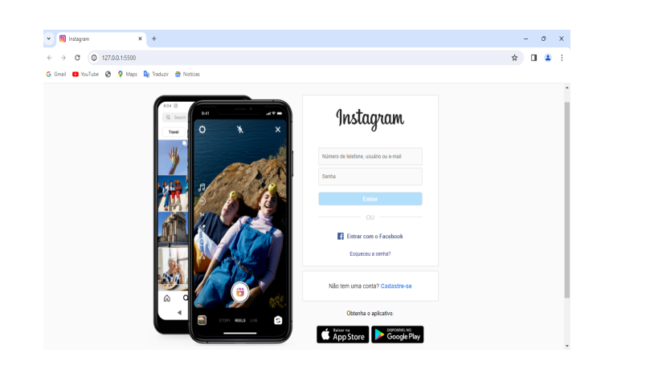

# Sobre o Projeto

Este projeto é um clone da página de login do Instagram, desenvolvido utilizando HTML, CSS e um design responsivo para versão mobile.

## Objetivo

O objetivo deste projeto é recriar a página de login do Instagram com a maior fidelidade o possível a versão original. Ele foi desenvolvido com a intenção de praticar e aprimorar habilidades em HTML, CSS e design responsivo. Desenvolvido como parte de um curso para aprender habilidades Front-End.

## Tecnologias Utilizadas

- HTML5

- CSS3

## Ferramentas De Desenvolvimento

- Visual Studio Code

- Git

- GitHub

## Instalação

1. **Clone o repositório:**

2. **Abra o projeto no seu editor de código:**

3. **Abra o arquivo `index.html` em um navegador web:**

## Contato

- E-mail: matheus.c.miola@outlook.com

- LinkedIn: https://www.linkedin.com/in/matheus-calegari-miola-4226a1228/

- GitHub: https://github.com/Matheus-Calegari-Miola

## Futuras Melhorias

Haverão melhorias e expansão desse projeto em um futuro próximo.

## Autor

Matheus Calegari Miola